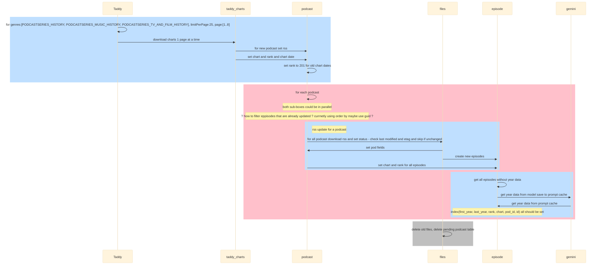

My 2 cents on testing -- use convex-test to write unit tests for your backend functions, use a fake of the ConvexReactClient to test any complicated render logic in your UI, write a few e2e tests (e.g. against a staging project or against a preview deployment) to check that all the major flows work all the way through.

There's less test coverage on things that cross backend <-> UI (e.g. there could be a bug that's not caught by tests because the fake implementation for your backend functions used in UI tests doesn't match up with the actual implementation), but hopefully the majority of issues get caught by the unit tests.

Re: dependency injection + backend functions -- I kind of view convex-test as something that dependency injects ctx with something that gives you easy methods to set up data in your db, set up auth, etc.
testing jiust backend 
https://docs.convex.dev/testing/convex-test
mock convex client 
https://stack.convex.dev/testing-react-components-with-convex
