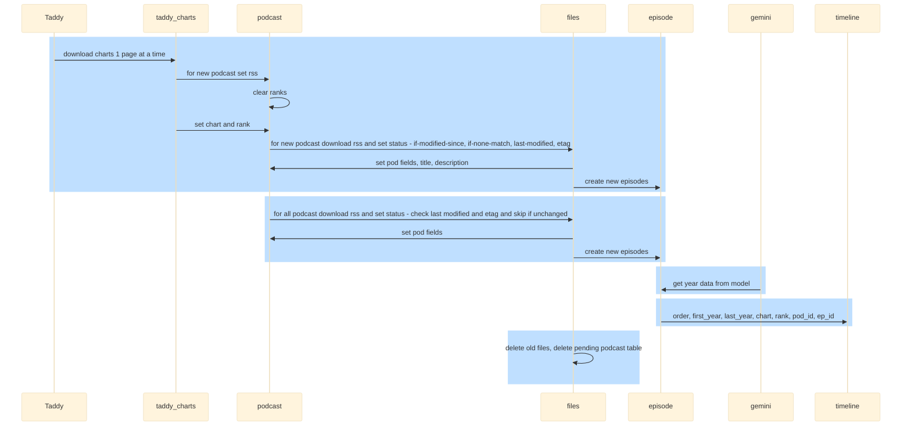

```mermaid
%%{init: {'theme': 'base', 'sequence': { 'actorFontSize': 14, 'actorBackground': '#ff9999' }}}%%
sequenceDiagram
    participant T as Taddy
    participant td as taddy_charts
    participant p as podcast
    participant f as files
    participant e as episode
    participant g as gemini
    participant t as timeline

    rect rgb(191, 223, 255)
    T->>td: download charts 1 page at a time
    td->>p: for new podcast set rss
    p->>p: clear ranks
    td->>p: set chart and rank
    p->>f: for new podcast download rss and set status - if-modified-since, if-none-match, last-modified, etag
    f->>p: set pod fields, title, description
    f->>e: create new episodes
    end

    rect rgb(191, 223, 255)
    p->>f: for all podcast download rss and set status - check last modified and etag and skip if unchanged
    f->>p: set pod fields
    f->>e: create new episodes
    end

    rect rgb(191, 223, 255)
    g->>e: get year data from model
    end

    rect rgb(191, 223, 255)
    e->>t: order, first_year, last_year, chart, rank, pod_id, ep_id
    end

    rect rgb(191, 223, 255)
    f->>f: delete old files, delete pending podcast table
    end

```
